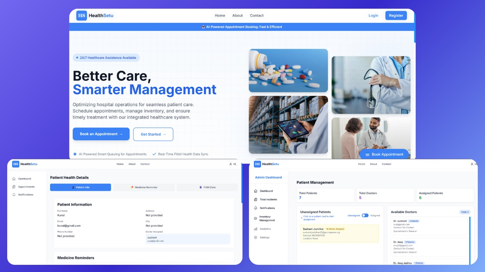
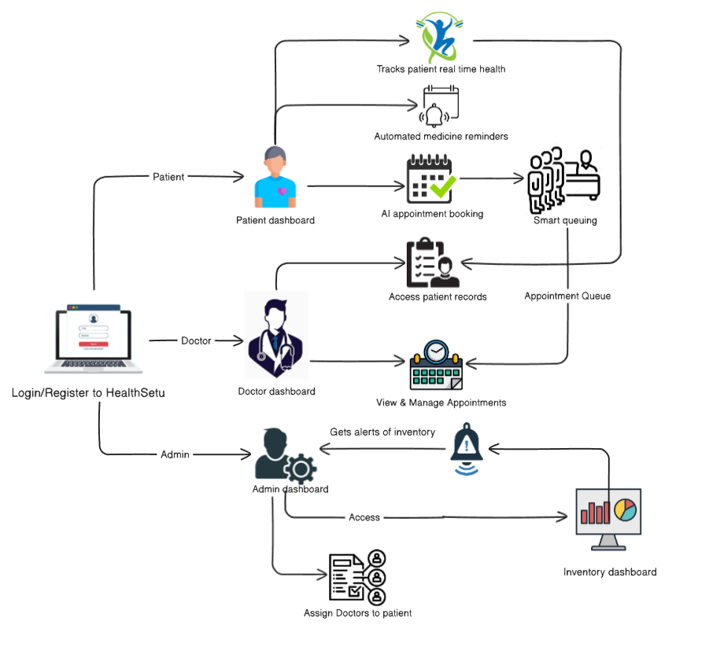
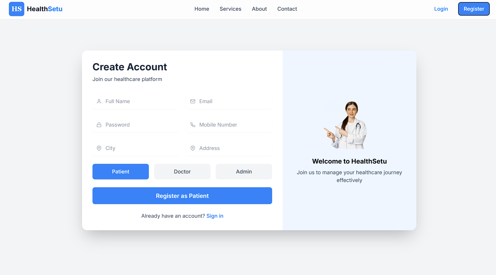
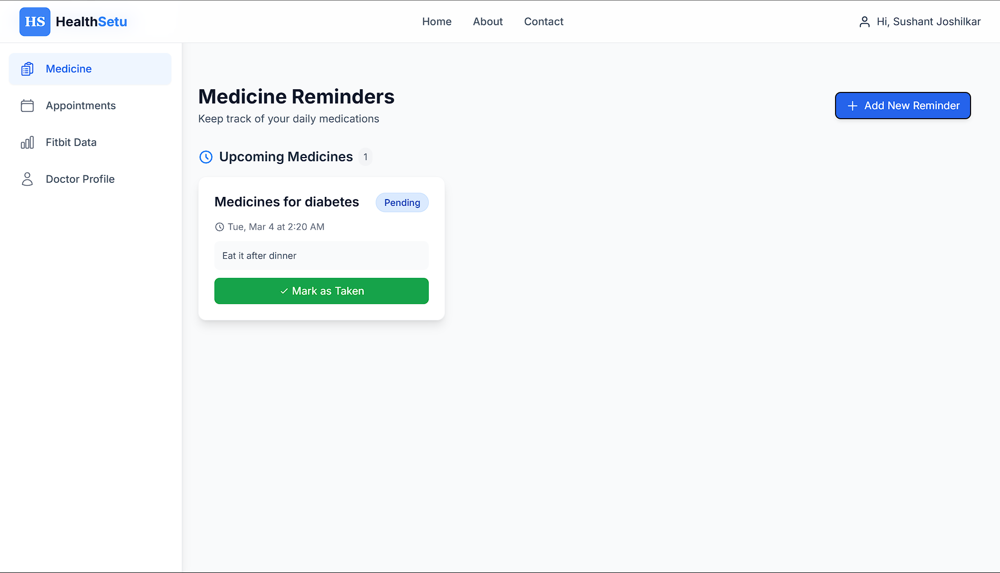
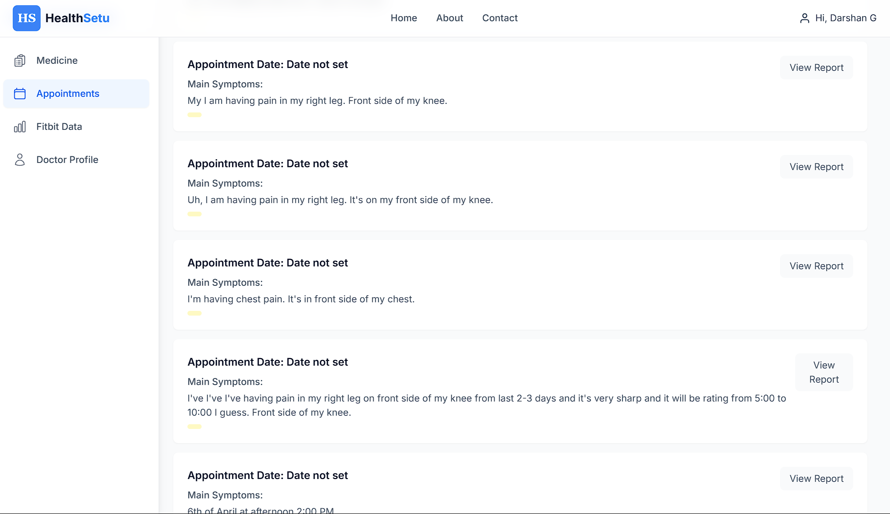
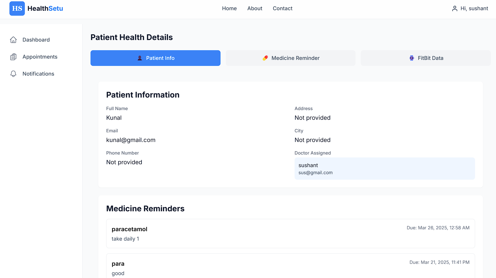
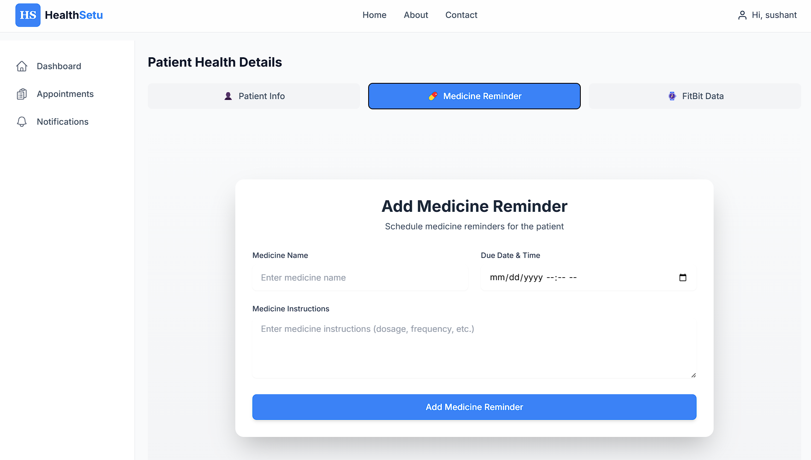
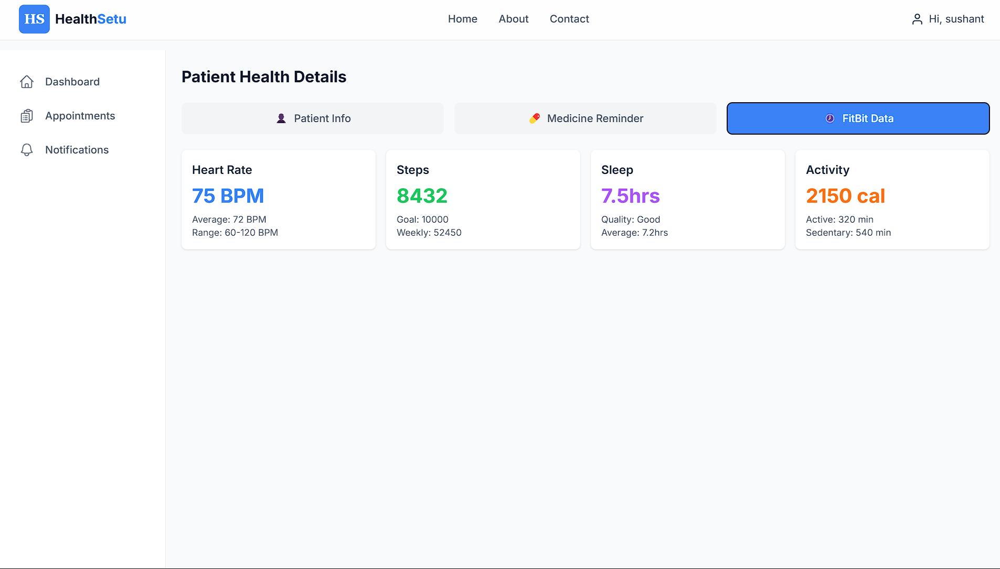
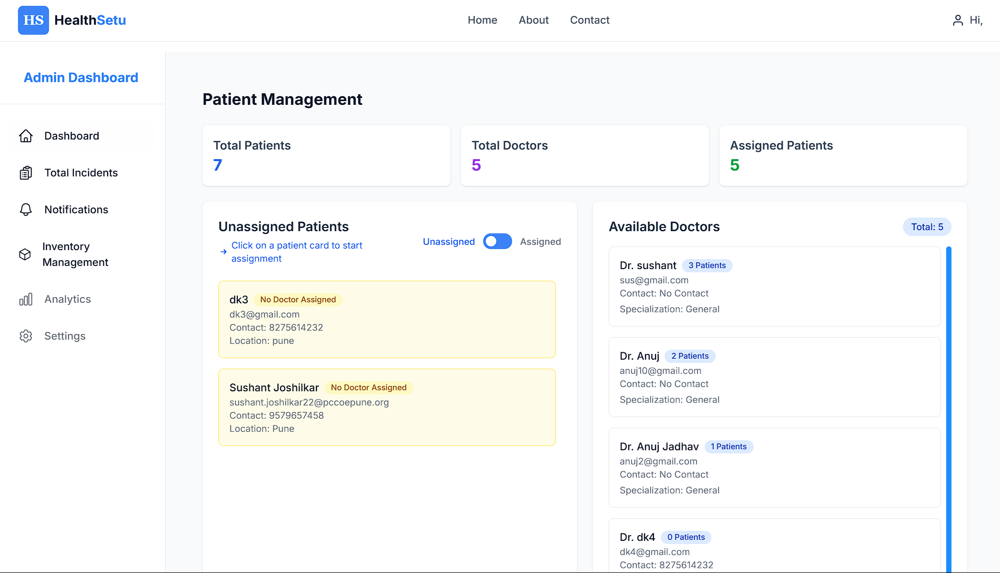
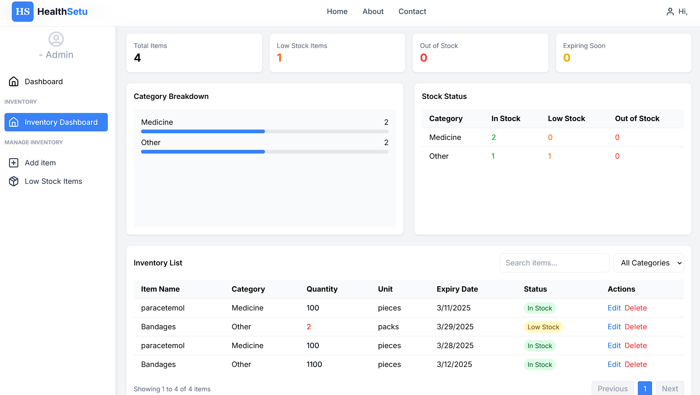

## Problem Statement

Theme : Healthcare

Problem statement title : Design and Implementation of an Integrated Healthcare Management System for Efficient Patient Care and Hospital Operations

Problem statement : Healthcare institutions require efficient systems to manage patient care, doctor schedules, and administrative tasks. Implementing role-based dashboards for patients, doctors, and administrators can streamline workflows and improve communication. A smart queuing system for doctor-patient appointments ensures efficient scheduling, reducing waiting times. Additionally, inventory management is crucial for maintaining adequate stock levels of medical supplies, while automated medicine reminders enhance patient adherence to prescribed treatments. The objective is to design an integrated healthcare management system that optimizes hospital operations and enhances patient care.

## What is HealthSetu?
HealthSetu is an integrated healthcare management platform designed to streamline hospital operations and enhance patient care. It provides role-based dashboards for patients, doctors, and administrators, ensuring efficient workflow and improved communication.A smart queuing system optimizes doctor-patient scheduling, reducing waiting times and enhancing hospital efficiency.



## How We Solve the Problem
1. Patients can book appointments using an AI voice assistant, track real-time health data, and receive automated medicine reminders for timely adherence.
2. Doctors gain access to patient records, manage appointments, and monitor real-time health data for better diagnosis and treatment.
3. Admins oversee doctor-patient assignments, manage hospital inventory (add, update, delete stock), and ensure optimal resource allocation.
4. A smart queuing system optimizes doctor-patient scheduling, reducing waiting times and enhancing efficiency.
5. Automated workflows improve communication between patients, doctors, and administrators, ensuring seamless hospital operations.
6. AI-driven insights help in early diagnosis, better treatment plans, and overall healthcare optimization.



## Inspiration
In the healthcare industry, efficient coordination between patients, doctors, and administrators is crucial for optimized hospital operations and enhanced patient care. However, traditional systems often lead to long waiting times, mismanaged appointments, and inventory shortages. HealthSetu bridges this gap by providing role-based dashboards that streamline patient bookings with an AI voice assistant, real-time health tracking, and automated medicine reminders. Doctors can efficiently manage appointments, access patient records, and monitor health data, while administrators oversee doctor-patient assignments and inventory management.

## What It Does
HealthSetu is an integrated healthcare management platform that enhances patient care, doctor coordination, and hospital administration through smart automation and AI-driven insights:

- **AI-Powered Appointment Booking** -Patients can schedule appointments using a voice assistant for a seamless experience.
- **Automated Medicine Reminders** - Patients receive timely alerts to ensure adherence to prescribed medications.
- **Real-time Health Tracking** -  Continuous monitoring of patient vitals for improved diagnosis and treatment.
- **Multi-role System** - Specialized dashboards for:
  - Patients
  - Doctors 
  - Admin 


## User Access
Users can log in in three ways: as a patient, doctor, or admin.




## Dashboards
After signin, patients, doctors and admin can access their respective dashboards.

### Patient Dashboard
- Book appointments using an AI voice assistant.
- Receive automated medicine reminders for timely adherence.
- Track real-time health data and monitor vitals.

Patient can add medicine reminders


Appointments for patient


### Doctor Dashboard
- Access patient records and medical history.
- View and manage appointments efficiently.
- Track real-time patient health data for better diagnosis.

Doctor dashboard


Add reminders for patient


Access patients real time health data


### Admin Dashboard
- Assign doctors to patients based on availability and specialization.
- Manage hospital inventory (add, update, delete stock).
- Monitor hospital-wide operations and optimize resource allocation.  


Admin dashboard


Inventory management


## Live demo link 
https://healthsetu.netlify.app/


## Testing
For testing, use the following credentials:

**Patient Account:**
- Email: sushant.joshilkar22@pccoepune.org
- Password: @sushant04

**Doctor Account:**
- Email: kunalbodke25@gmail.com
- Password: @kunal04

**Admin Account:**
- Email: anujjadhav@gmail.com
- Password: @anuj04


## 🛠️ Tech Stack
### Frontend:
- React.js
- Tailwind CSS
- Daisy UI

### Backend:
- Node.js
- Express.js
- JWT Authentication
- MongoDB
- Python

## ✨ Key Features


### For Patient:
- PWA (progressive web application) feature for patient to download our website as moblie application.
- Track real time health data with fitbit.
- Book appointments using an AI voice assistant.
- Receive automated medicine reminders for timely adherence.
- AI For explaning reports
- Personal Doctor

### For Doctor:
- Access patient records and medical history.
- Access patients real time health data for efficient monitoring.
- View and manage appointments and medical reminders of patient efficiently.
- Smart automatic prescription generation. 

### For Admin:
- Assign doctors to patients based on availability.
- Manage hospital inventory (add, update, delete stock).
- Monitor hospital-wide operations and optimize resource allocation.
- Medicine demand forecasting using patient data insights.
- Smart logistics and distribution network between hospitals.


## 🚀 Getting Started Locally
### 1. Clone the Repository
```sh
git clone https://github.com/Anuj5504/HM0023_MLE.git
cd HM0023_MLE
```

### 2. Configure Environment Variables

Create a `.env` file in the `server` directory and include the following:
```sh
MONGO_URI = your_mongodb_uri
JWT_SECRET = your_jwt_secret
GEMINI_API_KEY= your_gemini_api_key
EMAIL_USER=your_email
EMAIL_PASS=your_email_pass
PORT=5000
GROQ_API_KEY=your_groq_api_key

```
Create a `.env` file in the `frontend` directory and include the following:
```sh
VITE_API_URL=http://localhost:5000
```

### 3. Backend Setup
```sh
cd server   
npm install
npm run start
```
Ensure all dependencies are installed. If errors occur, double-check your environment and installed packages.

### 4. Frontend Setup
```sh
cd frontend
npm install
npm run dev
```

### 5. Launch the Application
Visit the following URL in your browser: [http://localhost:5173/](http://localhost:5173/)


